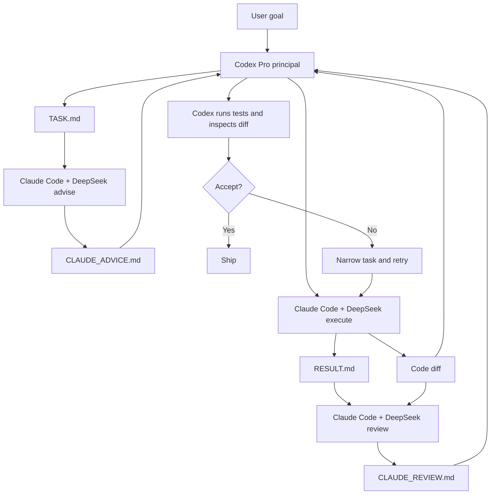
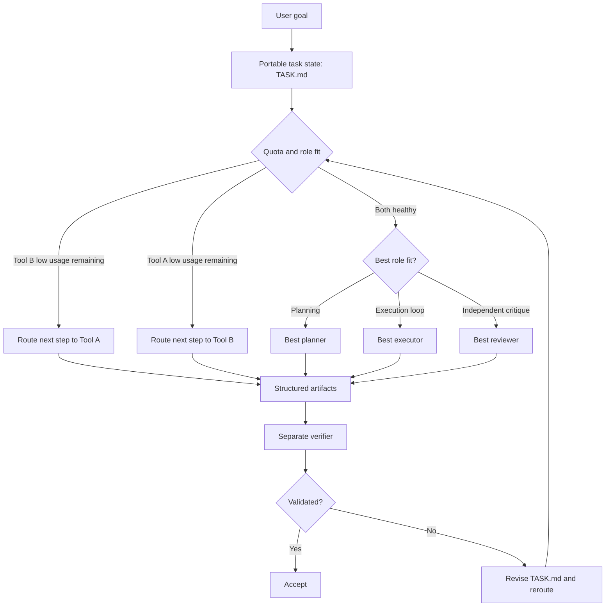
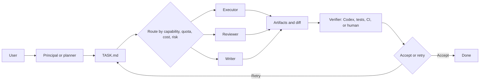

# Codex-Claude Executor Framework

> A usage-aware and capability-aware multi-tool workflow for local coding experiments.

This repository provides a reference implementation of a broader method: use durable task artifacts to route work across multiple AI coding tools by **capability**, **remaining usage**, **marginal cost**, **risk**, and **verifiability**.

The implemented demo uses:

- **Codex** as the principal planner, permission judge, and final verifier.
- **Claude Code + DeepSeek API** as a lower-cost delegated adviser, executor, and reviewer.

That pairing is only one case. The same method also applies when a user has two comparable monthly subscriptions, or any mixture of coding agents, writing models, API models, local scripts, CI, and human reviewers.

## Core Idea

Do not move context by repeatedly pasting long chat summaries between models. Instead, persist context as auditable files:

```text
TASK.md              portable task specification
CLAUDE_ADVICE.md     independent planning critique
RESULT.md            execution report
CLAUDE_REVIEW.md     independent review
run-summary.json     execution metadata
test logs            verification evidence
```

The stronger or scarcer model spends its budget on decisions that are hard to verify. The cheaper or more available model spends its budget on work that is easy to verify.

## Why This Matters

Users often subscribe to several AI tools at once. A common failure pattern is:

```text
Use Model A until usage runs out
-> manually summarize context
-> restart in Model B
-> lose decisions, failed attempts, file state, and validation history
```

This framework replaces that with:

```text
Persist context in TASK.md
-> route the next step to the best available tool
-> require structured output
-> verify with tests and diff inspection
```

The result is lower context migration cost, better quota utilization, and clearer accountability.

## Two Primary Cases

### Case A: Strong Principal + Cheap Executor

This is the current reference implementation. Codex Pro is stronger and better suited for planning, safety decisions, and final acceptance. Claude Code with DeepSeek API is cheaper but weaker, so it is used for bounded execution loops when validation is available.



Decision rule:

- Use Codex for architecture, risk judgment, permissions, and final verification.
- Use Claude Code + DeepSeek for repetitive edits, debug loops, and second opinions.
- Accept nothing until Codex or deterministic tests verify the result.

### Case B: Comparable Monthly Subscriptions

This case is not about one model being much cheaper. It is about two or more tools with similar monthly plans but separate usage limits. The goal is to avoid exhausting one tool and then paying a large context migration cost.



Decision rule:

- Balance tools by remaining subscription usage before a quota emergency happens.
- Route tasks by role fit, not brand loyalty.
- Keep final verification separate from the agent that made the edit.
- Use `TASK.md` as the portable context layer so switching tools is cheap.

## General Multi-Tool Flow

The framework generalizes beyond Codex and Claude:



Possible role assignments:

| Role | Responsibility | Example tools |
|---|---|---|
| Principal | Owns goals, constraints, safety, and final acceptance | Codex Pro, senior human, strongest coding agent |
| Planner | Converts intent into `TASK.md` | Codex, GPT Pro, Claude |
| Executor | Performs bounded implementation loops | Claude Code, Codex CLI, cheaper API model |
| Reviewer | Gives independent critique | Any second model or human reviewer |
| Writer | Produces polished prose or slides | GPT Pro, Claude, domain writing model |
| Verifier | Runs tests and audits files | Codex, CI, scripts, human |

## Implemented Modes

The bundled Codex skill supports three Claude delegation modes:

| Mode | Purpose | Writes | Edits code? |
|---|---|---|---|
| `advise` | Independent task analysis, risks, and validation plan | `CLAUDE_ADVICE.md` | No |
| `execute` | Scoped implementation and requested validation | `RESULT.md` | Yes |
| `review` | Independent review of diff, logs, and result | `CLAUDE_REVIEW.md` | No |

Recommended loop:

```text
Codex plan -> Claude advise -> Codex revise task -> Claude execute -> Claude review -> Codex final verification
```

## Repository Layout

```text
.
|-- README.md
|-- docs/
|   |-- paper.md
|   |-- manual.md
|   |-- scheduler.md
|   |-- generalized-framework.md
|   |-- methodology.md
|   `-- workflow.md
|-- demo/
|   |-- TASK.md
|   |-- stats_utils.py
|   |-- test_stats_utils.py
|   |-- CLAUDE_ADVICE.md
|   |-- RESULT.md
|   `-- CLAUDE_REVIEW.md
|-- skills/
|   `-- claude-executor/
|       |-- SKILL.md
|       |-- agents/openai.yaml
|       `-- scripts/
|           |-- Set-ClaudeExecutor.ps1
|           `-- Invoke-ClaudeExecutor.ps1
`-- scripts/
    `-- install-skill.ps1
```

## Quick Start

Prerequisites:

- Windows PowerShell
- Git
- Claude Code CLI installed
- Claude Code configured to use DeepSeek API through an Anthropic-compatible endpoint

Install the skill into your local Codex skills folder:

```powershell
& ".\scripts\install-skill.ps1"
```

Enable the executor with a small budget:

```powershell
& "$HOME\.codex\skills\claude-executor\scripts\Set-ClaudeExecutor.ps1" -Enabled $true -MaxBudgetUsd 0.20 -PermissionMode auto
```

Run the demo workflow:

```powershell
& "$HOME\.codex\skills\claude-executor\scripts\Invoke-ClaudeExecutor.ps1" `
  -Mode advise `
  -TaskPath ".\demo\TASK.md" `
  -Workspace ".\demo"

& "$HOME\.codex\skills\claude-executor\scripts\Invoke-ClaudeExecutor.ps1" `
  -Mode execute `
  -TaskPath ".\demo\TASK.md" `
  -Workspace ".\demo"

& "$HOME\.codex\skills\claude-executor\scripts\Invoke-ClaudeExecutor.ps1" `
  -Mode review `
  -TaskPath ".\demo\TASK.md" `
  -Workspace ".\demo"
```

Then verify independently:

```powershell
cd .\demo
python -m unittest
```

Disable after use:

```powershell
& "$HOME\.codex\skills\claude-executor\scripts\Set-ClaudeExecutor.ps1" -Enabled $false
```

## Documentation

- [Academic-style paper](docs/paper.md): problem statement, architecture, workflow, evaluation criteria, and limitations.
- [User manual](docs/manual.md): installation, task writing, three-pass usage, recovery, and verification.
- [Usage-aware scheduler](docs/scheduler.md): routing based on usage, cost, risk, and model strengths.
- [Generalized framework](docs/generalized-framework.md): extension beyond Codex + Claude/DeepSeek to any multi-tool setup.
- [Methodology](docs/methodology.md): role separation and acceptance rule.
- [Workflow](docs/workflow.md): state machine, permission strategy, and run artifacts.

## Demo Result

The included demo fixes a small Python function:

- `summarize([1, None, 3, 5])` should ignore `None`.
- Empty or all-`None` input should raise `ValueError`.
- Claude proposes the fix, implements it, and reviews the result.
- Codex independently runs `python -m unittest` and accepts only after tests pass.

Observed local validation:

```text
Ran 2 tests in 0.001s

OK
```

## Safety Model

- Default config is disabled.
- Claude is never treated as authoritative.
- No API keys are stored in this repo.
- Runtime config is written outside the repo at:

```text
$HOME\.codex\claude-executor\config.json
```

- Avoid `--dangerously-skip-permissions` and `bypassPermissions`.
- Prefer branch or worktree isolation for non-trivial tasks.
- Review `git diff` and rerun tests before accepting any result.

## License

MIT
