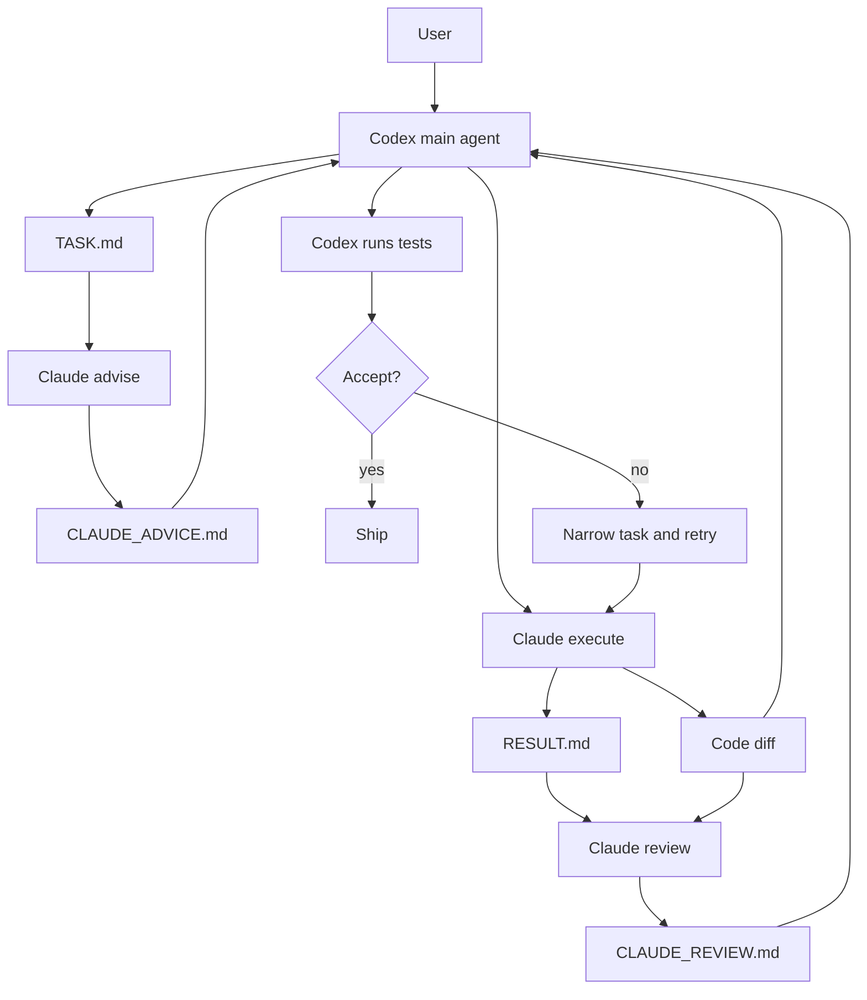

# Codex-Claude Executor Framework

一个面向本地科研实验、代码试错和工程任务的多代理工作流：

**Codex 负责规划、权限判断和最终验收；Claude Code + DeepSeek API 负责低成本执行、独立建议和独立审查。**

这个项目来自一个已跑通的本地 demo。目标不是让多个模型同时失控地改代码，而是把它们组织成一个可审计、可开关、可验收的工程流程。

## Why

单独使用高能力模型做所有事情时，成本和上下文消耗会集中在反复试错阶段。这个框架把任务拆成两层：

- **Codex main agent**：高质量规划、任务边界、权限控制、测试验收、最终裁决。
- **Claude Code executor**：基于 DeepSeek API 做低成本多轮试验、实现、第二意见。

核心收益：

- 降低 Codex 在重复实现和修错阶段的用量。
- 通过 `advise -> execute -> review` 增加独立检查。
- 所有 Claude 输出都落盘为文件，方便 Codex 和人类复核。
- 默认禁用，按任务显式启用，降低误调用和权限风险。

## Architecture



## Modes

| Mode | Purpose | Writes | Edits code? |
|---|---|---|---|
| `advise` | Claude independently analyzes the task, risks, and validation plan | `CLAUDE_ADVICE.md` | No |
| `execute` | Claude implements the task and runs requested validation | `RESULT.md` | Yes |
| `review` | Claude independently reviews diff, result, and logs | `CLAUDE_REVIEW.md` | No |

Recommended loop:

```text
Codex plan -> Claude advise -> Codex revise task -> Claude execute -> Claude review -> Codex final verification
```

## Repository Layout

```text
.
|-- README.md
|-- docs/
|   |-- methodology.md
|   `-- workflow.md
|-- demo/
|   |-- TASK.md
|   |-- stats_utils.py
|   |-- test_stats_utils.py
|   |-- CLAUDE_ADVICE.md
|   |-- RESULT.md
|   `-- CLAUDE_REVIEW.md
|-- skills/
|   `-- claude-executor/
|       |-- SKILL.md
|       |-- agents/openai.yaml
|       `-- scripts/
|           |-- Set-ClaudeExecutor.ps1
|           `-- Invoke-ClaudeExecutor.ps1
`-- scripts/
    `-- install-skill.ps1
```

## Quick Start

Prerequisites:

- Windows PowerShell
- Git
- Claude Code CLI installed
- Claude Code configured to use DeepSeek API through an Anthropic-compatible endpoint

Install the skill into your local Codex skills folder:

```powershell
& ".\scripts\install-skill.ps1"
```

Enable the executor:

```powershell
& "$HOME\.codex\skills\claude-executor\scripts\Set-ClaudeExecutor.ps1" -Enabled $true -MaxBudgetUsd 0.20 -PermissionMode auto
```

Run a delegated task:

```powershell
& "$HOME\.codex\skills\claude-executor\scripts\Invoke-ClaudeExecutor.ps1" `
  -Mode advise `
  -TaskPath ".\demo\TASK.md" `
  -Workspace ".\demo"

& "$HOME\.codex\skills\claude-executor\scripts\Invoke-ClaudeExecutor.ps1" `
  -Mode execute `
  -TaskPath ".\demo\TASK.md" `
  -Workspace ".\demo"

& "$HOME\.codex\skills\claude-executor\scripts\Invoke-ClaudeExecutor.ps1" `
  -Mode review `
  -TaskPath ".\demo\TASK.md" `
  -Workspace ".\demo"
```

Then Codex or a human reviewer should run final validation:

```powershell
cd .\demo
python -m unittest
```

Disable after use:

```powershell
& "$HOME\.codex\skills\claude-executor\scripts\Set-ClaudeExecutor.ps1" -Enabled $false
```

## Demo Result

The included demo fixes a small Python function:

- `summarize([1, None, 3, 5])` should ignore `None`.
- Empty or all-`None` input should raise `ValueError`.
- Claude proposes the fix, implements it, and reviews the result.
- Codex independently runs `python -m unittest` and accepts only after tests pass.

Observed local validation:

```text
Ran 2 tests in 0.001s

OK
```

## Safety Model

- Default config is disabled.
- Claude is never treated as authoritative.
- No API keys are stored in this repo.
- Runtime config is written outside the repo at:

```text
$HOME\.codex\claude-executor\config.json
```

- Avoid `--dangerously-skip-permissions` and `bypassPermissions`.
- Prefer branch or worktree isolation for non-trivial tasks.
- Review `git diff` and rerun tests before accepting any result.

## License

MIT

