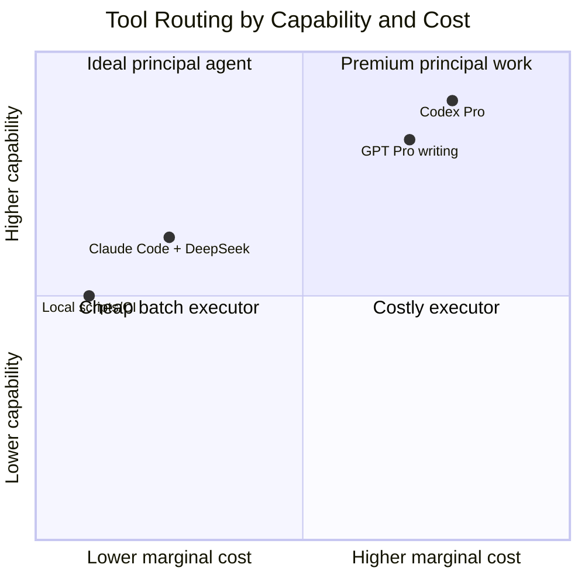
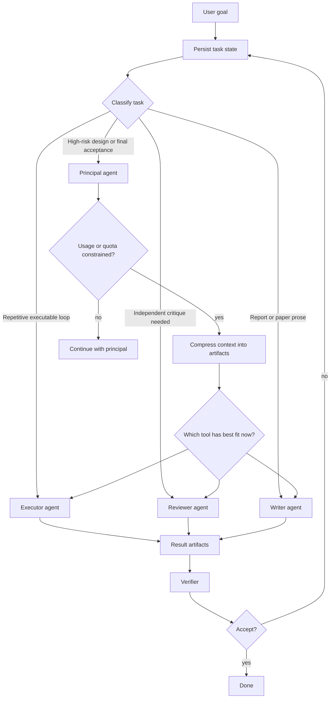

# Generalized Multi-Tool Framework

## Scope

The Codex-Claude setup is one reference implementation:

- Codex Pro can act as a stronger principal agent.
- Claude Code with DeepSeek API can act as a lower-cost but weaker executor.

The broader method applies to any combination of AI tools:

- two similar monthly subscriptions with separate usage caps;
- one high-capability model plus one lower-cost API model;
- several coding agents with different tool permissions;
- one writing model, one coding model, and one local verifier;
- human experts mixed with AI agents.

The framework is therefore a **usage-aware and capability-aware task routing method**, not a fixed two-model recipe.

## General Roles

| Role | Description | Example tools |
|---|---|---|
| Principal | Owns goals, constraints, safety, and final acceptance | Codex Pro, stronger coding agent, human lead |
| Planner | Converts user intent into portable task artifacts | Codex, GPT Pro, Claude |
| Executor | Performs bounded implementation or experiment loops | Claude Code, Codex CLI, cheaper API model |
| Reviewer | Gives independent critique of outputs and diffs | Any second model or human reviewer |
| Writer | Produces polished reports, papers, or presentation text | GPT Pro, Claude, domain writing model |
| Verifier | Runs tests, checks files, audits artifacts | Codex, scripts, CI, human |

A single tool can play multiple roles, but a high-risk task should not rely on one role only.

## Tool Selection Matrix



Interpretation:

- High-capability, high-cost tools should focus on planning, risk judgment, and final verification.
- Lower-cost tools should absorb repetitive execution when tests are strong.
- Comparable subscription tools should be balanced according to remaining usage and current task fit.
- Local deterministic tools should verify whenever possible.

## Comparable Monthly Subscription Case

When two tools have similar monthly plans, the goal is not simply to choose the "best" model. The goal is to avoid wasting either plan while preserving quality.

Example:

```text
Tool A: 40% usage remaining, better at repository edits
Tool B: 80% usage remaining, better at long-form reasoning
Task: medium-risk coding bug with tests
Decision:
1. Tool B performs independent advice.
2. Tool A or cheaper executor performs implementation.
3. Tool B or Codex reviews.
4. Deterministic tests verify.
```

This prevents a common failure mode:

```text
Use Tool A until quota is exhausted -> manually summarize context -> restart in Tool B
```

Instead, the portable task state allows:

```text
Persist context in TASK.md -> route next step to the best available tool -> verify with evidence
```

## General Routing Flow



## Portable Context Contract

Any participating tool should read and write artifacts instead of relying on hidden chat memory:

```text
TASK.md             required task state
RESULT.md           implementation report
ADVICE.md           planning critique
REVIEW.md           independent review
run-summary.json    execution metadata
test logs           verification evidence
```

This is the mechanism that reduces context migration cost.

## Design Rule

The stronger or more expensive model should spend its budget on decisions that are hard to verify. The cheaper or more available model should spend its budget on work that is easy to verify.

