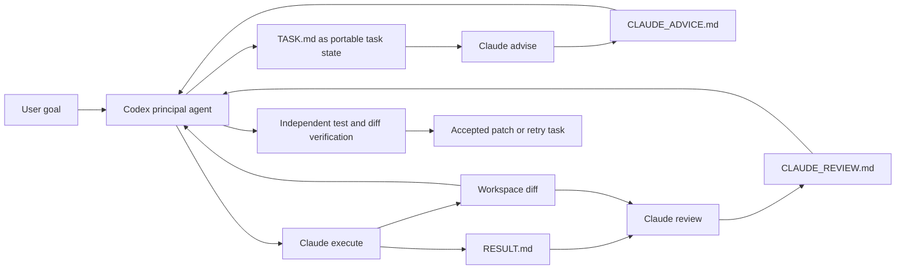
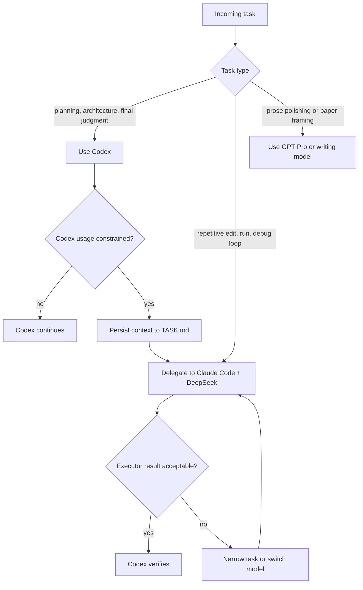
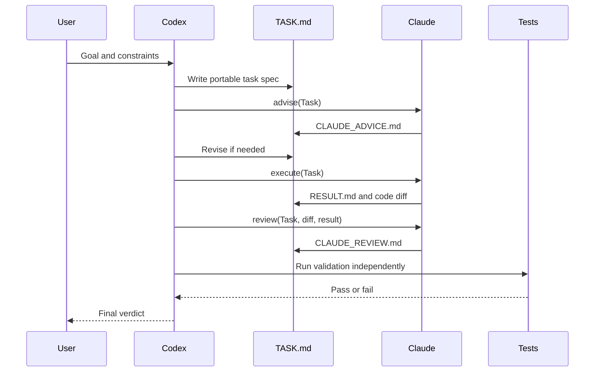

# Codex-Claude Executor Framework: A Usage-Aware Multi-Agent Workflow for Local Coding Experiments

## Abstract

Interactive coding agents are increasingly used for scientific experiments, software prototyping, and local automation. In practice, users often subscribe to multiple AI coding tools with different usage limits, strengths, and interaction patterns. When one model reaches a quota limit, users manually migrate context to another model, causing repeated explanation, lost state, inconsistent decisions, and lower productivity. This project proposes a usage-aware and capability-aware multi-tool workflow that separates task planning and final verification from implementation attempts. The current implementation uses Codex as the principal agent and Claude Code backed by DeepSeek API as adviser, executor, and reviewer, but the methodology generalizes to any combination of stronger premium models, cheaper API models, and comparable monthly subscription tools. The framework introduces structured task artifacts, explicit enable/disable controls, bounded permission modes, and usage-aware delegation. A demo task shows that the workflow can complete a coding fix through `advise -> execute -> review -> verify` while preserving auditability and reducing the amount of high-capability interaction spent on repetitive trial-and-error.

## 1. Introduction

Users who work with local coding agents often face three practical constraints:

1. **Usage limits**: subscription-based tools may have message, time, or usage caps.
2. **Model heterogeneity**: different agents perform better on different subtasks, such as planning, editing, debugging, or writing.
3. **Context migration cost**: manually moving a task from one model to another requires restating goals, repository state, decisions, failures, and validation requirements.

The common workaround is manual switching: use one agent until usage is constrained, then paste context into another. This is inefficient because context is not represented as durable, executable artifacts. The proposed framework treats context as files (`TASK.md`, `RESULT.md`, `CLAUDE_ADVICE.md`, `CLAUDE_REVIEW.md`) and treats agent switching as a controlled workflow rather than an ad hoc conversation transfer. The same idea applies whether the tools have very different marginal costs or similar flat-rate monthly usage limits.

## 2. Problem Definition

Given a local software task with source files, tests, and user constraints, the objective is to:

- minimize expensive principal-agent usage spent on repetitive implementation loops;
- reduce manual context migration between agents;
- preserve quality through independent review and final verification;
- keep permissions and API costs bounded;
- leave a durable task trail that can be resumed by another model or a human.

## 3. Proposed Architecture

The reference implementation uses a two-level agent hierarchy:

- **Principal agent**: Codex plans, constrains, validates, and accepts or rejects work.
- **Delegated agent**: Claude Code, configured with DeepSeek API, provides independent advice, implementation attempts, and review.

At the methodological level, these names can be replaced by any tool pair or tool group. A stronger model can serve as principal, a cheaper model can serve as executor, and a peer subscription model can serve as adviser or reviewer when its remaining quota is healthier.

## 4. Usage-Aware Delegation

The practical innovation is not only multi-agent execution. The more useful point is **usage-aware workload allocation**.

When users have multiple constrained tools, the framework lets the principal agent decide which work should be delegated based on:

- remaining usage budget;
- API cost budget;
- expected task difficulty;
- need for independent reasoning;
- risk level of edits;
- model strengths.

Two cases are supported:

- **Asymmetric tools**: one stronger or more expensive model, one cheaper but weaker model. Route hard-to-verify judgment to the stronger model and easy-to-verify loops to the cheaper model.
- **Comparable subscription tools**: several tools have similar monthly plans and separate usage limits. Route tasks to balance remaining usage while preserving model fit.

This reduces context migration cost because the task is already represented in a durable handoff file. The next model does not need a long conversation history; it reads the task, outputs structured evidence, and the principal verifier checks the result.

## 5. Workflow

The recommended workflow is:

1. Codex writes `TASK.md`.
2. Claude runs `advise` and writes `CLAUDE_ADVICE.md`.
3. Codex revises the task if the advice exposes ambiguity.
4. Claude runs `execute` and writes `RESULT.md`.
5. Claude runs `review` and writes `CLAUDE_REVIEW.md`.
6. Codex inspects the diff, runs tests, and accepts or rejects.

## 6. Safety and Permission Model

The framework is intentionally conservative:

- The executor is disabled by default.
- The principal agent must explicitly enable it.
- The default permission mode is `auto`.
- Dangerous permission bypass is not used by default.
- Every delegated run writes a timestamped log folder.
- Claude's claims are treated as untrusted until Codex verifies them.

## 7. Demo

The included demo fixes a Python function:

- input: `[1, None, 3, 5]`;
- expected summary: `{"count": 3, "mean": 3.0, "min": 1, "max": 5}`;
- empty or all-`None` input should raise `ValueError`.

The run produced:

- `CLAUDE_ADVICE.md`: implementation strategy and risk analysis;
- `RESULT.md`: changed files and test result;
- `CLAUDE_REVIEW.md`: second-pass findings;
- Codex final validation: `python -m unittest` passed.

## 8. Evaluation Criteria

For real tasks, the framework should be evaluated by:

- number of Codex turns saved;
- number of manual context migrations avoided;
- executor API cost;
- tests passed after Codex verification;
- number and severity of review findings;
- time from task definition to accepted patch;
- frequency of permission escalations.

## 9. Limitations

- The current implementation targets Windows PowerShell.
- It assumes Claude Code CLI is already configured.
- Usage accounting is policy-based, not yet automatically integrated with provider usage APIs.
- Mermaid diagrams render on GitHub but are not exported as static image assets.
- The executor may still make poor edits; Codex verification remains mandatory.

## 10. Conclusion

The Codex-Claude Executor Framework turns multi-model usage from manual context switching into a structured, auditable workflow. Its central contribution is a practical separation of responsibilities: stronger or quota-constrained models preserve high-value reasoning and final authority, while cheaper or more available tools perform bounded, verifiable implementation and review work. By persisting context in task artifacts and routing work according to usage, cost, risk, and model strengths, the framework can reduce context migration friction and improve reliability for local coding experiments.
