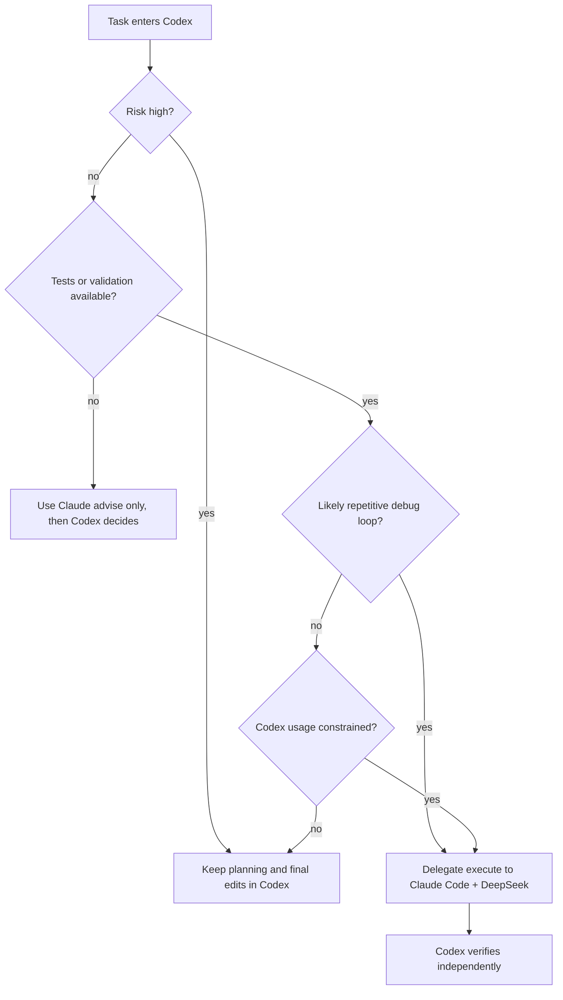
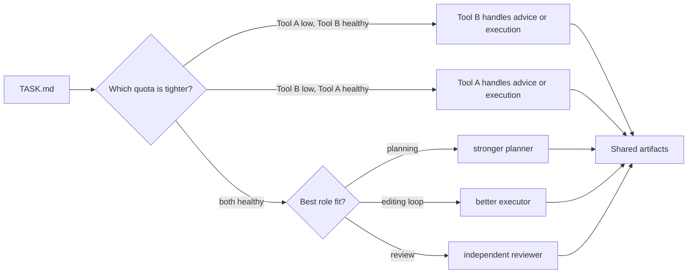

# Usage-Aware Scheduler Design

## Motivation

Many users operate under multiple model subscriptions or API budgets. The framework supports both asymmetric and symmetric cases:

- **Asymmetric case**: one model is clearly stronger but more expensive or more quota-limited; another is cheaper but weaker.
- **Symmetric subscription case**: two or more tools have similar monthly plans, similar marginal cost, and separate quota windows.

A practical workflow should avoid the pattern:

```text
Agent A reaches quota -> user manually summarizes context -> Agent B restarts from partial context
```

This creates context migration cost. The framework reduces this cost by making `TASK.md` and result artifacts the portable state layer.

## Routing Inputs

A usage-aware scheduler should consider:

| Signal | Meaning |
|---|---|
| `codex_remaining` | remaining Codex usage or willingness to spend Codex turns |
| `executor_budget_usd` | allowed DeepSeek API budget for delegated runs |
| `task_risk` | possible damage if the executor makes a bad edit |
| `task_loopiness` | expected number of trial-and-error cycles |
| `context_size` | amount of repo/task context needed |
| `validation_strength` | whether objective tests exist |
| `model_fit` | which agent is better suited for the current subtask |
| `subscription_balance` | whether one monthly tool is close to exhaustion while another has available quota |

## Routing Policy



## Symmetric Subscription Balancing

When two tools are roughly comparable monthly subscriptions, route work by remaining quota and role fit rather than always using one favorite model.



The goal is not perfect automatic optimization. The goal is to avoid emergency context migration after a model is already exhausted.

## Practical Scoring Function

A simple manual score can be used before automatic integration exists:

```text
delegate_score =
  2 * task_loopiness
+ 2 * validation_strength
+ 1 * codex_usage_pressure
+ 1 * context_portability
+ 1 * subscription_balance_pressure
- 3 * task_risk
- 2 * secret_or_system_config_risk
```

Suggested decision:

- `delegate_score >= 3`: use Claude executor.
- `delegate_score between 1 and 2`: use `advise` first.
- `delegate_score <= 0`: keep in Codex.

## Example Decisions

| Scenario | Decision | Reason |
|---|---|---|
| Small Python bug with tests | Delegate execute | Low risk, strong validation |
| Refactor across many modules | Advise first, then maybe execute narrow slices | Higher blast radius |
| Editing API keys or environment config | Keep in Codex or require explicit user approval | High safety risk |
| Generating paper prose | Use GPT Pro or writing model | Better model fit |
| Running many parameter experiments | Delegate repeated runs | Loop-heavy |

## Context Migration Reduction

The key artifact is `TASK.md`. It replaces a long conversational transfer with a stable specification:

```text
Goal
Allowed files
Forbidden files
Required behavior
Validation commands
Required output format
```

When switching models, the next model reads this file and writes structured output. This makes model switching cheap enough to be part of the workflow rather than an emergency fallback.

## Future Automation

Potential future additions:

- automatic reading of provider usage APIs;
- dynamic `MaxBudgetUsd` based on task score;
- automatic retry with narrower task scopes;
- worktree isolation per delegation;
- structured JSON result schema;
- dashboard showing Codex turns saved, executor cost, and success rate.
