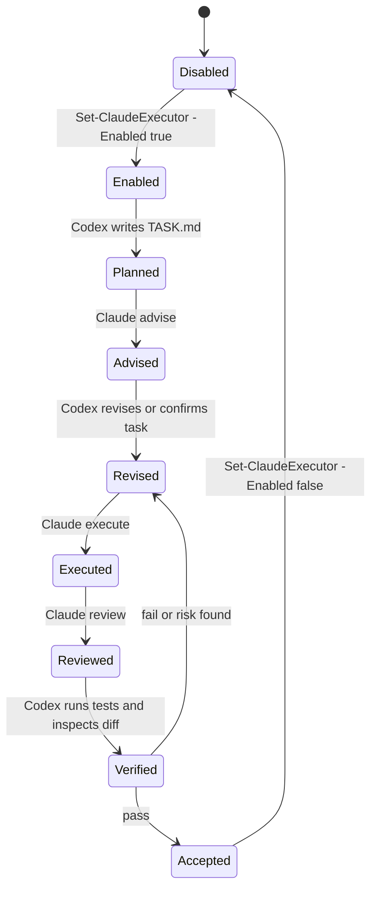

# Workflow

## State Machine



## Permission Strategy

Default config:

```json
{
  "enabled": false,
  "permissionMode": "auto",
  "maxBudgetUsd": 1.0,
  "outputFormat": "json",
  "requireResultFile": true
}
```

Recommended demo config:

```powershell
& "$HOME\.codex\skills\claude-executor\scripts\Set-ClaudeExecutor.ps1" `
  -Enabled $true `
  -MaxBudgetUsd 0.20 `
  -PermissionMode auto
```

Do not use `bypassPermissions` as a default. If a task needs broader permission, Codex should first inspect the failure, narrow the task, and only then ask the user for a specific approval.

## Files Produced Per Run

Each invocation creates a timestamped run folder beside the task:

```text
claude-run-YYYYMMDD-HHMMSS/
|-- prompt.txt
|-- claude-output.json
|-- claude-error.txt
`-- run-summary.json
```

Mode output files:

```text
CLAUDE_ADVICE.md
RESULT.md
CLAUDE_REVIEW.md
```

## Verification Checklist

- Read `run-summary.json`.
- Read the mode output file.
- Inspect changed files.
- Run required validation commands.
- Check no secret or local path was accidentally committed.
- Disable the executor after the delegated task is complete.

